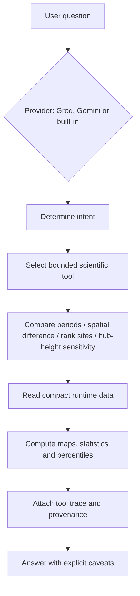

# North Sea Wind Intelligence — Agentic EERIE Prototype

Live demo: https://wind-energy-ai-agent.streamlit.app/

A compact, agentic-interface Streamlit prototype for exploratory offshore wind screening over the North Sea using km-scale climate output from the **EERIE IFS-FESOM2-SR** `highres-future-ssp245` simulation.

The app is built for live demonstration: it runs from a small pre-computed runtime package (~1.6 MB) and does **not** fetch the full raw EERIE dataset during deployment.

## Technologies

Python · Xarray · Dask · Zarr · Streamlit · Agentic AI · IFS-FESOM2 · EERIE

## Scope and disclaimer

This work is for **research and exploratory analysis only**. It is not a decision-support, engineering, or investment tool. The outputs are intended to illustrate how km-scale climate data and a bounded agentic interface can support wind-energy questions, not to replace site-specific measurement campaigns, microscale modelling, or due-diligence workflows.

## What this prototype demonstrates

- **Kilometre-scale climate data for wind screening:** EERIE IFS-FESOM2-SR at ~9 km atmosphere / ~5 km ocean on its native reduced Gaussian grid.
- **Future period comparison:** January and July 2020–2024 versus 2036–2040 under SSP2-4.5.
- **Wind-resource metrics:** 10 m wind speed, wind direction, air density, wind-power density (WPD), and hub-height sensitivity via a power-law assumption.
- **Agentic interface:** A rule-based and LLM-aided agent that calls bounded scientific tools, reports its execution trace, and states the limitations. A deterministic built-in agent is available when no API key is configured.

## Data source and provenance

- **Model:** EERIE IFS-FESOM2-SR, `highres-future-ssp245` (future scenario, not the historical run).
- **Resolution:** ~9 km atmosphere (Tco1279) coupled to ~5 km FESOM2.5 ocean (NG5).
- **Periods used in the app:** January and July for 2020–2024 and 2036–2040.
- **Variables extracted:** `m10u`, `m10v` (10 m wind components), `mean2t` (2 m temperature), `msp` (mean sea-level pressure), `msst` (sea-surface temperature).
- **Prepared region:** −5° to 13°E, 50° to 62°N.
- **Access:** DKRZ km-scale cloud Zarr endpoint.
- **Data catalogue:** https://km-scale-cloud.dkrz.de/datasets
- **EERIE project:** https://eerie-project.eu/

### Important height limitation

The EERIE 2D daily output provides **10 m wind only**, not 100 m or hub-height wind. All hub-height numbers in the app are extrapolations using a power-law shear assumption and are **illustrative**, not bankable.

### Masking status

The expanded cache is a bounding-box extraction. The app uses finite `msst` as a preliminary ocean proxy to exclude many land points, but a final hydrographic North Sea polygon has **not** yet been applied.

## Project structure

```
wind-energy-agentic-analysis/
├── app.py                                   # Streamlit application
├── README.md                                # This file
├── requirements.txt                         # Python dependencies
├── .gitignore
├── .streamlit/
│   └── secrets.toml                         # Gemini/Groq API keys (do not commit)
├── data/
│   ├── runtime/january/                     # Compact January artifacts
│   └── runtime/july/                        # Compact July artifacts
├── largeData/                               # Full extracted EERIE cache (gitignored)
├── notebooks/
│   └── ARCHIVED_01_eerie_download_preprocess.ipynb  # Old demonstrator, archived
└── src/
    ├── build_runtime_artifacts.py           # Build the compact runtime package
    ├── january_analysis.py                  # Window/period helpers and guardrails
    ├── january_agent_tools.py               # Bounded scientific tools for the agent
    ├── llm_providers.py                     # Gemini / Groq OpenAI-compatible provider layer
    ├── runtime_data.py                      # Load the compact runtime package
    └── wind_energy.py                       # WPD, Weibull, capacity factor, power-law
```

The `data/runtime/` directory is the artifact that should be uploaded with the public deployment. The `largeData/` cache is kept for local rebuilding and is excluded from Git.

## Installation

```bash
python -m venv venv
venv\Scripts\activate           # Windows
# source venv/bin/activate      # macOS/Linux

pip install -r requirements.txt
```

## Configuration

API keys are read from Streamlit secrets or environment variables. Copy the example and add your keys:

```toml
# .streamlit/secrets.toml
GEMINI_API_KEY = "your-key-here"
GROQ_API_KEY = "your-key-here"
```

For Streamlit Community Cloud, add `GEMINI_API_KEY` and `GROQ_API_KEY` under **Settings → Secrets**.

**API quota and reliability:** Groq and Gemini need a configured API key; and currently you are using the app developer's keys, which can hit rate limits. Groq's `openai/gpt-oss-120b` usually answers well, but for a reliable live demo the **Built-in scientific agent** is recommended because it runs entirely offline.

## Running the app

```bash
streamlit run app.py
```

The app has three tabs:

1. **North Sea overview** — maps of mean wind and WPD, downloaded variables, and the daily distribution.
2. **Site explorer** — reference site details, Weibull fit, 120 m capacity factor, AEP, day-of-month profiles, and hub-height sensitivity.
3. **Agent workspace** — ask the agent to compare periods, rank sites, explain limitations, or run a guided screening workflow.

## Wind energy metrics

- **Wind speed:** `sqrt(m10u² + m10v²)` at 10 m.
- **Air density:** ideal gas law, `ρ = p / (R_d T)`, using MSLP and 2 m temperature.
- **Wind power density (WPD):** `0.5 · ρ · v³` at 10 m.
- **Hub-height wind:** `v(z) = v(10) · (z / 10)^α` with a user-chosen shear exponent `α`.
- **Capacity factor:** the NREL 15 MW IEA reference power curve applied to the hub-height wind. The turbine has a 120 m hub height; the demo uses 120 m hub height.

## Agentic workflow

The agent is not a free-form chatbot. It is a bounded tool-calling system with access to a small, fixed set of climate and wind-analysis tools:



The available tools are:

- Compare two January or July windows.
- Calculate spatial differences in wind and WPD.
- Identify the highest-resource grid regions.
- Compare and rank reference sites.
- Return site-level wind distributions.
- Test hub-height sensitivity.
- Explain analysis limitations.

The agent shows its execution trace and is instructed to always report the key caveats.

## Limitations

- Single EERIE model realisation; no ensemble uncertainty.
- Only two months (January and July) and five years per window; the comparisons are exploratory, not robust climate trends.
- Daily mean data lose intraday variability, so power-curve and capacity-factor estimates are biased downward and are not bankable.
- Wind is at 10 m; hub-height values require an explicit power-law assumption.
- The ~9 km grid does not resolve turbine wakes, coastal effects, or micro-scale flow.
- No hydrographic North Sea mask has been applied; the ocean proxy is preliminary.

## Future expansion

This prototype is intentionally narrow. Useful extensions include:

- a) other km-scale model results for wind-energy analysis (e.g., multi-model comparison, more SSPs, longer climatologies);
- b) solar energy over the North Sea or Europe to be included;
- c) more built-in tools for agentic AI analysis (e.g., real EEZ overlay, wake and loss-factor integration, measured validation, multi-period trend assessment).

## License and attribution

Project code is released under the MIT License. EERIE data is licensed separately by the data provider; see the DKRZ and EERIE project pages for terms.

If you use the EERIE data, please cite the dataset record referenced on the EERIE data-access documentation.
